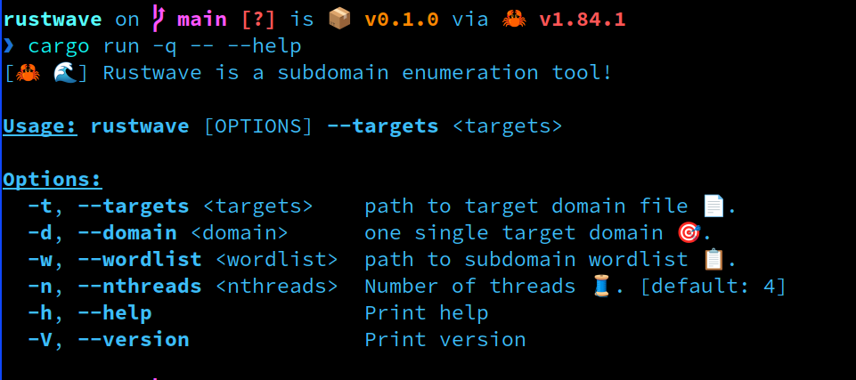
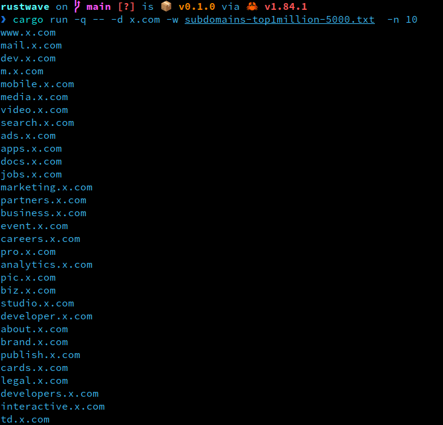

```
 cargo run -q -- --help


                                        
[🦀 🌊] Rustwave is a subdomain enumeration tool!

Usage: rustwave [OPTIONS] --targets <targets>

Options:
  -t, --targets <targets>    path to target domain file 📄.
  -d, --domain <domain>      one single target domain 🎯.
  -w, --wordlist <wordlist>  path to subdomain wordlist 📋.
  -n, --nthreads <nthreads>  Number of threads 🧵. [default: 4]
  -h, --help                 Print help
  -V, --version              Print version
```





